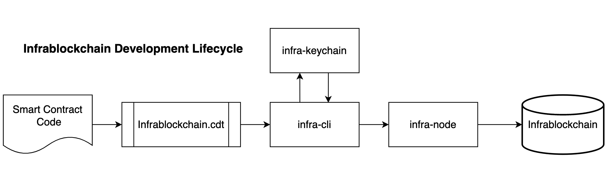

# Platform & Toolchain

## Local development environment

* [Getting Started](development-environment-infrablockchain-native/prerequisites.md): Install the InfraBlockchain platform in your local development environment.

## Toolchain

The InfraBlockchain platform is made up of the following components and toolchain:

1. `infra-node`:  the core InfraBlockchain node daemon that can be configured with plugins to run a node. Example uses are block production, dedicated API endpoints, and local development.
2. `infra-cli`: the command line interface to interact with the blockchain and to manage wallets.
3. `infra-keychain`: the component that securely stores InfraBlockchain keys in wallets.
4. `infrablockchain.cdt`: toolchain for WebAssembly (Wasm) and a set of tools to facilitate smart contract writing for the InfraBlockchain platform.

The basic relationship between these components is illustrated in the following diagram:

Infrablockchain also provides a frontend library for javascript development called Infrablockchain-js.

## Infra-node

Infra-node is the core InfraBlockchain node daemon. Infra-node handles the blockchain data persistence layer, peer-to-peer networking, and contract code scheduling. For development environments, Infra-node enables you to set up a single node blockchain network. Infra-node offers a wide range of features through plugins which can be enabled or disabled at start time via the command line parameters or configuration files.

## Infra-cli

`infra-cli` is a command line tool that interfaces with the REST APIs exposed by `infra-node`. You can also use `infra-cli` to deploy and test InfraBlockchain smart contracts.

## Infra-keychain

`infra-keychain` is a key manager daemon for storing private keys and signing digital messages. `infra-keychain` provides a secure key storage medium for keys to be encrypted in the associated wallet file. The `infra-keychain` daemon also defines a secure enclave for signing transaction created by `infra-cli` or a third party library.

`infra-keychain` can be accessed using the wallet API, but it is important to note that the intended usage is for local light client applications. `infra-keychain` is not for cross network access by web applications trying to access users' wallets.

## Infrablockchain.cdt

Infrablockchain.cdt is a toolchain for WebAssembly (Wasm) and a set of tools to facilitate contract writing for the InfraBlockchain platform. In addition to being a general-purpose WebAssembly toolchain, EOSIO-specific optimizations are available to support building InfraBlockchain smart contracts. This new toolchain is built around Clang 7, which means that InfraBlockchain.cdt has most of the current optimizations and analyses from LLVM.

## Infrablockchain-js

A Javascript API SDK for integration with InfraBlockchain-based blockchains using the InfraBlockchain RPC API.
